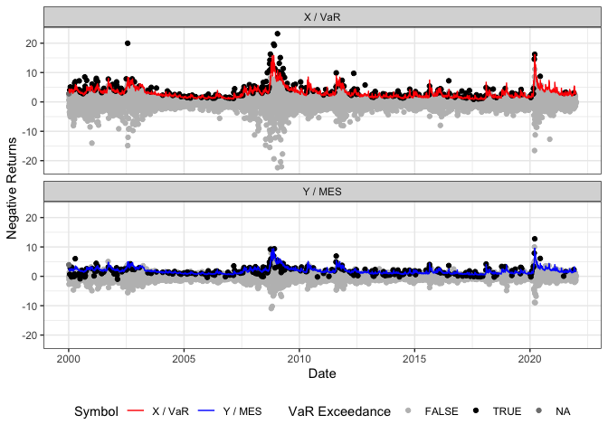

<!-- README.md is generated from README.Rmd. Please edit that file -->

# SystemicRisk

<!-- badges: start -->
<!-- badges: end -->

The SystemicRisk package fits (dynamic) CoVaR and MES Regression Models
in the sense that it semiparametrically models the Value at Risk (VaR),
i.e., the $\beta$-quantile of $X_t$ jointly with the
$\alpha|\beta$-CoVaR or the $\beta$-MES of a series $Y_t$ given $X_t$.

## Installation

You can install the development version of SystemicRisk from
[GitHub](https://github.com/) with:

``` r
# install.packages("devtools")
devtools::install_github("TimoDimi/SystemicRisk")
```

## Example

This is a basic example which shows you how to solve a common problem:

``` r
library(quantmod)
#> Loading required package: xts
#> Loading required package: zoo
#> 
#> Attaching package: 'zoo'
#> The following objects are masked from 'package:base':
#> 
#>     as.Date, as.Date.numeric
#> Loading required package: TTR
#> Registered S3 method overwritten by 'quantmod':
#>   method            from
#>   as.zoo.data.frame zoo
library(tidyr)
library(dplyr)
#> 
#> ######################### Warning from 'xts' package ##########################
#> #                                                                             #
#> # The dplyr lag() function breaks how base R's lag() function is supposed to  #
#> # work, which breaks lag(my_xts). Calls to lag(my_xts) that you type or       #
#> # source() into this session won't work correctly.                            #
#> #                                                                             #
#> # Use stats::lag() to make sure you're not using dplyr::lag(), or you can add #
#> # conflictRules('dplyr', exclude = 'lag') to your .Rprofile to stop           #
#> # dplyr from breaking base R's lag() function.                                #
#> #                                                                             #
#> # Code in packages is not affected. It's protected by R's namespace mechanism #
#> # Set `options(xts.warn_dplyr_breaks_lag = FALSE)` to suppress this warning.  #
#> #                                                                             #
#> ###############################################################################
#> 
#> Attaching package: 'dplyr'
#> The following objects are masked from 'package:xts':
#> 
#>     first, last
#> The following objects are masked from 'package:stats':
#> 
#>     filter, lag
#> The following objects are masked from 'package:base':
#> 
#>     intersect, setdiff, setequal, union
library(tsibble)
#> 
#> Attaching package: 'tsibble'
#> The following object is masked from 'package:zoo':
#> 
#>     index
#> The following objects are masked from 'package:base':
#> 
#>     intersect, setdiff, union
library(SystemicRisk)

# Get data from Yahoo Finance
data_Symbols <- lapply(c("JPM", "^GSPC"), function(x) {
  getSymbols(x,
             from = "2000/01/01",
             to = "2021/12/31",
             periodicity = "daily",
             auto.assign = FALSE) %>%
    data.frame(Date=zoo::index(.), check.names=FALSE) %>%
    rename_all(~stringr::str_replace_all(., paste0(x,"."), ""))
})
names(data_Symbols) <- c("JPM", "SP500")

# Collect data as a tsibble with x and y as column names
data_Assets <- dplyr::bind_rows(data_Symbols, .id = "Asset") %>%
  dplyr::group_by(Asset) %>%
  dplyr::mutate(Date=lubridate::as_date(Date),
         NegReturn= -100*(log(Close) - log(lag(Close)))) %>%
  dplyr::select(Date, Asset, NegReturn) %>%
  stats::na.omit() %>%
  tidyr::pivot_wider(names_from=Asset, values_from=NegReturn) %>%
  dplyr::rename(x=JPM, y=SP500) %>%
  tsibble::as_tsibble(index=Date)


# Fit a CoCAViaR-SAV-fullA model
CoCAViaR_obj <- SRM(data=data_Assets,
                    model="CoCAViaR_SAV_fullA", 
                    risk_measure="CoVaR", 
                    beta=0.95, 
                    alpha=0.95)

# Get standard errors and print its summary
summary(CoCAViaR_obj)
#> 
#> VaR Coefficients:
#>             Estimate Std. Error t value  Pr(>|t|)    
#> (Intercept) 0.054091   0.160081  0.3379  0.735455    
#> lag |X|     0.168976   0.052671  3.2081  0.001344 ** 
#> lag |Y|     0.178439   0.124771  1.4301  0.152734    
#> lag VaR     0.853420   0.059332 14.3837 < 2.2e-16 ***
#> 
#>  CoVaR Parameter Estimates:
#>             Estimate Std. Error t value  Pr(>|t|)    
#> (Intercept)  0.25853    0.58157  0.4445    0.6567    
#> lag |X|      0.11912    0.17040  0.6991    0.4845    
#> lag |Y|      0.39401    0.30868  1.2764    0.2019    
#> lag CoVaR    0.79223    0.19874  3.9863 6.798e-05 ***
#> ---
#> Signif. codes:  0 '***' 0.001 '**' 0.01 '*' 0.05 '.' 0.1 ' ' 1

# Plot the time series and estimated (in-sample) VaR/CoVaR
p <- plot(CoCAViaR_obj)
#> Warning: Removed 2 rows containing missing values (`geom_line()`).
```


``` r


## Download VIX index:
data_VIX <- getSymbols("^VIX",
             from = "2000/01/01",
             to = "2021/12/31",
             periodicity = "daily",
             auto.assign = FALSE) %>%
    data.frame(Date=zoo::index(.), check.names=FALSE) %>%
  select(Date, VIX.Close) %>%
  rename(VIX = VIX.Close)
#> Warning: ^VIX contains missing values. Some functions will not work if objects
#> contain missing values in the middle of the series. Consider using na.omit(),
#> na.approx(), na.fill(), etc to remove or replace them.

# Merge data frames
data_Assets_VIX <- full_join(data_Assets, data_VIX, by="Date") %>%
  mutate(Intercept = 1) %>%
  select(Date, x, y, VIX, Intercept) %>%
  na.omit()

# Fit a linear MES regression model (with the lagged absolute values of X_t as explanatory variables)
MES_reg <- SRM(data=data_Assets_VIX,
               model="joint_linear", 
               risk_measure="MES", 
               beta=0.95)

# Get standard errors and print its summary
summary(MES_reg)
#> 
#> VaR Coefficients:
#>            Estimate Std. Error t value  Pr(>|t|)    
#> VIX        0.209109   0.011799 17.7223 < 2.2e-16 ***
#> Intercept -1.092828   0.178286 -6.1296 9.417e-10 ***
#> 
#>  MES Parameter Estimates:
#>            Estimate Std. Error t value  Pr(>|t|)    
#> VIX        0.124891   0.018235  6.8488 8.255e-12 ***
#> Intercept -0.662195   0.318142 -2.0814   0.03744 *  
#> ---
#> Signif. codes:  0 '***' 0.001 '**' 0.01 '*' 0.05 '.' 0.1 ' ' 1

# Plot the time series and estimated (in-sample) VaR/MES
p2 <- plot(MES_reg)
#> Warning: Removed 2 rows containing missing values (`geom_line()`).
```


