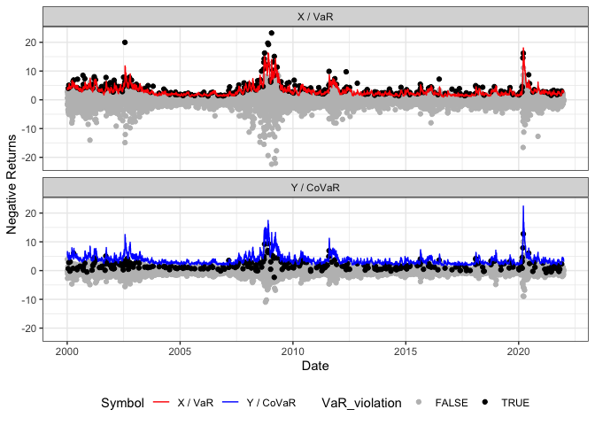

<!-- README.md is generated from README.Rmd. Please edit that file -->

# CoQR

<!-- badges: start -->
<!-- badges: end -->

The CoQR package fits a dynamic Co-Quantile Regression in the sense that
it semiparametrically models the Value at Risk (VaR), i.e., the
-quantile
of

jointly with the
-CoVaR
of a series

given
.

## Installation

You can install the development version of CoQR from
[GitHub](https://github.com/) with:

``` r
# install.packages("devtools")
devtools::install_github("TimoDimi/CoQR")
```

## Example

This is a basic example which shows you how to solve a common problem:

``` r
library(quantmod)
#> Warning: Paket 'quantmod' wurde unter R Version 4.1.2 erstellt
#> Lade nötiges Paket: xts
#> Lade nötiges Paket: zoo
#> Warning: Paket 'zoo' wurde unter R Version 4.1.2 erstellt
#> 
#> Attache Paket: 'zoo'
#> Die folgenden Objekte sind maskiert von 'package:base':
#> 
#>     as.Date, as.Date.numeric
#> Lade nötiges Paket: TTR
#> Registered S3 method overwritten by 'quantmod':
#>   method            from
#>   as.zoo.data.frame zoo
library(tidyr)
library(dplyr)
#> Warning: Paket 'dplyr' wurde unter R Version 4.1.2 erstellt
#> 
#> Attache Paket: 'dplyr'
#> Die folgenden Objekte sind maskiert von 'package:xts':
#> 
#>     first, last
#> Die folgenden Objekte sind maskiert von 'package:stats':
#> 
#>     filter, lag
#> Die folgenden Objekte sind maskiert von 'package:base':
#> 
#>     intersect, setdiff, setequal, union
library(tsibble)
#> 
#> Attache Paket: 'tsibble'
#> Das folgende Objekt ist maskiert 'package:zoo':
#> 
#>     index
#> Die folgenden Objekte sind maskiert von 'package:base':
#> 
#>     intersect, setdiff, union
library(CoQR)

# Get data from Yahoo Finance
data_Symbols <- lapply(c("JPM", "^GSPC"), function(x) {
  getSymbols(x,
             from = "2000/01/01",
             to = "2021/12/31",
             periodicity = "daily",
             auto.assign = FALSE) %>%
    data.frame(Date=zoo::index(.), check.names=FALSE) %>%
    rename_all(~stringr::str_replace_all(., paste0(x,"."), ""))
})
names(data_Symbols) <- c("JPM", "SP500")

# Collect data as a tsibble with x and y as column names
data_Assets <- dplyr::bind_rows(data_Symbols, .id = "Asset") %>%
  dplyr::group_by(Asset) %>%
  dplyr::mutate(Date=lubridate::as_date(Date),
         NegReturn= -100*(log(Close) - log(lag(Close)))) %>%
  dplyr::select(Date, Asset, NegReturn) %>%
  stats::na.omit() %>%
  tidyr::pivot_wider(names_from=Asset, values_from=NegReturn) %>%
  dplyr::rename(x=JPM, y=SP500) %>%
  tsibble::as_tsibble(index=Date)


# Fit a CoCAViaR-SAV-fullA model
CoCAViaR_obj <- CoQR(data=data_Assets,
                     model="CoCAViaR_SAV_fullA", 
                     SRM="CoVaR", 
                     beta=0.95, 
                     alpha=0.95)

# Get standard errors and print its summary
summary(CoCAViaR_obj)
#> 
#> VaR Coefficients:
#>             Estimate Std. Error t value  Pr(>|t|)    
#> (Intercept) 0.054091   0.159953  0.3382  0.735250    
#> lag |X|     0.168976   0.052725  3.2049  0.001359 ** 
#> lag |Y|     0.178439   0.124983  1.4277  0.153434    
#> lag VaR     0.853420   0.059296 14.3926 < 2.2e-16 ***
#> 
#> CoVaR Coefficients:
#>             Estimate Std. Error t value Pr(>|t|)   
#> (Intercept)  0.26586    0.81959  0.3244  0.74567   
#> lag |X|      0.12585    0.18708  0.6727  0.50115   
#> lag |Y|      0.43136    0.39308  1.0974  0.27252   
#> lag CoVaR    0.78244    0.25806  3.0320  0.00244 **
#> ---
#> Signif. codes:  0 '***' 0.001 '**' 0.01 '*' 0.05 '.' 0.1 ' ' 1

# Plot the time series and estimated (in-sample) VaR/CoVaR
plot(CoCAViaR_obj)
```


